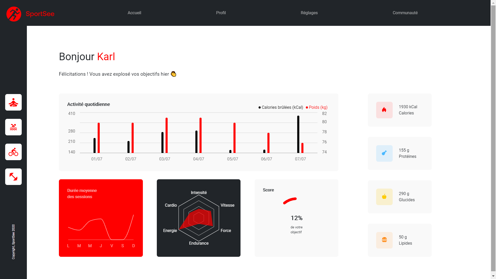

# SportSee

    Projet fictif de formation | OpenClassrooms

**Personnal Dashboard**
<kbd></kbd>

> PROBLEMATIQUE

Créer un tableau de bord analytique de performances sportives et indicateurs physiologiques

> BESOIN

Afficher les données utlisateur sous forme de graphique

## Compétences développées

- [x] Récupérer les données depuis l'API
- [x] Manipuler / Corriger les données selon le besoin
- [x] Repésenter graphiquement les données
- [x] Développer des Routes imbriquées
- [x] Gérer les différents cas liés à la réponse de la requête API
- [x] Développer une logique de code partitionné dans des composants réutilisables

## Ressources fournies

- [Maquette](https://www.figma.com/file/BMomGVZqLZb811mDMShpLu/UI-design-Sportify-FR)
- [Kanban](https://www.notion.so/Tableau-de-bord-SportSee-6686aa4b5f44417881a4884c9af5669e)

## Bibliothèques

    REACT
    RECHART
    AXIOS

## Installation

### Editeur recommandé

- [Visual Studio code](https://code.visualstudio.com/)

### Prérequis

- [Git](https://git-scm.com/) pour cloner les repos
- [nodeJS](https://nodejs.org/fr/) (version 14.18.1) pour exécuter les commandes
- [npm](https://www.npmjs.com/) (version15.5.2) pour lancer l'application (front-end)
- [Yarn](https://yarnpkg.com/) pour lancer l'API (back-end)

### Dépendances

- [Recharts](https://recharts.org/en-US/) (version 2.1.4)
- [react-router-dom](https://reactrouter.com/web/guides/quick-start) (version 5.3.0)
- [Prop-types](https://www.npmjs.com/package/prop-types) (version 15.7.2)

### Etape 1 : Lancement du back-end

- Cloner le repo du back-end : `git clone https://github.com/Fourcaud/sportsee.git`
- Aller dans ce dossier : `cd backend`
- Installer ses dépendances : `yarn`
- Le lancer sur le port 3000 (par défaut) : `yarn dev`

### Etape 2 : Lancement du front-end

- Cloner le repo du front-end : `git clone https://github.com/Fourcaud/sportsee.git`
- Aller dans ce dossier : `cd frontend`
- Installer ses dépendances : `npm install`
- Le lancer sur le port 3001 : `npm start`

```bash
URL de visualisation du rendu web : http://localhost:3001
l'API de SportSee fournit des données pour les utilisateurs d'id 12 et 18
```

---

## Installation (_english version_)

### Recommanded IDE

- [Visual Studio code](https://code.visualstudio.com/)

### Prerequisites

- [Git](https://git-scm.com/) to clone repositories
- [nodeJS](https://nodejs.org/fr/) to run commands
- [npm](https://www.npmjs.com/) to run application
- [Yarn](https://yarnpkg.com/) to run back-end

### Dependances

- [Recharts](https://recharts.org/en-US/) (version 2.1.4)
- [react-router-dom](https://reactrouter.com/web/guides/quick-start) (version 5.3.0)
- [Prop-types](https://www.npmjs.com/package/prop-types) (version 15.7.2)

### Step 1 : Installing and launching back-end

- Clone the back-end repository : `git clone https://github.com/Fourcaud/sportsee.git`
- Move to this folder : `cd backend`
- Install dependencies: `npm install`
- Launch back-end on port 3000 (default port): `npm run start`

### Step 2 : Installing and launching front-end

- Clone the front-end repository : `git clone https://github.com/Fourcaud/sportsee.git`
- Move to this folder : `cd frontend`
- Install dependencies : `npm install`
- Launch front-end on port 3001: `npm start`

```bash
Front-end is now rendered at URL http://localhost:3001
SportSee API only contains data for users with id 12 and 18
```
